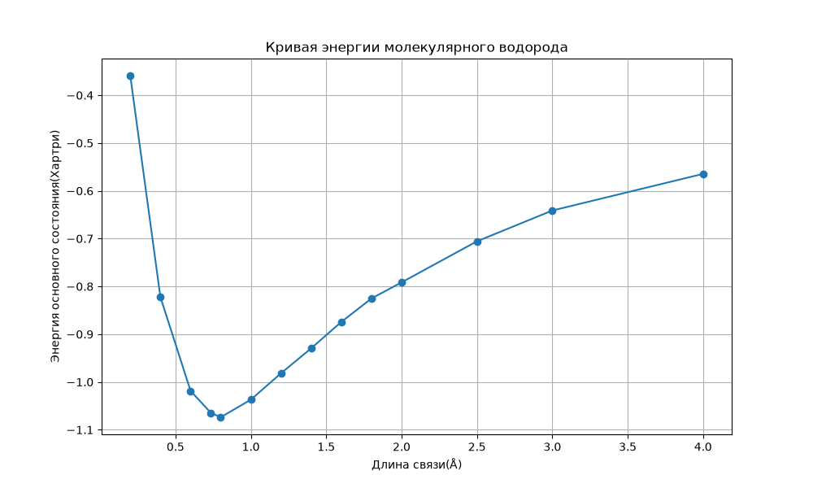
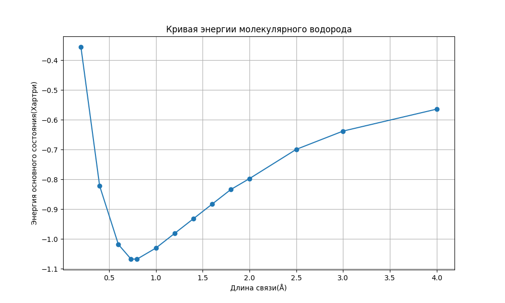

# Calculate_Energy_H2 🔬

**Quantum computation of the ground‑state energy of the hydrogen molecule (H₂)** – using the **Quantum Phase Estimation (QPE)** algorithm to accurately determine the ground‑state energy of H₂ on quantum computing platforms.

---

## 📖 About

The hydrogen molecule is one of the simplest molecular systems and a classic testbed for quantum chemistry. This project applies the **Quantum Phase Estimation** algorithm to map the molecular Hamiltonian onto qubits and extract the energy eigenvalue via phase estimation, achieving high‑precision computation of the H₂ ground‑state energy.

The repository provides two implementations:

- 🐍 **Python** – using quantum computing libraries (e.g., Qiskit or PennyLane) for simulation.
- 🔷 **Q#** – built on the Microsoft Quantum Development Kit, running on Azure Quantum or local simulators.

---

## ✨ Key Features

- **Quantum Phase Estimation (QPE)** – leverages quantum Fourier transform and controlled unitary operations to extract phase information from the Hamiltonian.
- **Dual implementation** – choose between Python and Q# depending on your environment and preferences.
- **Molecular‑to‑qubit mapping** – transforms the electronic structure problem into a qubit Hamiltonian (using Jordan‑Wigner or Bravyi‑Kitaev transformations).
- **Extensible design** – clear structure that can be adapted to other small molecules (e.g., HeH⁺, LiH).

---

## 🧪 Calculation Methods

The project follows a rigorous quantum‑chemical methodology consisting of several key steps:

### 1. Construction of the molecular Hamiltonian
- The **Born–Oppenheimer approximation** is used – nuclei are fixed, and the electronic problem is solved for a given geometry.
- The electronic Hamiltonian is written in **second quantization** using creation and annihilation operators.
- One‑ and two‑electron integrals are computed using standard quantum‑chemical basis sets (e.g., STO‑3G, 6‑31G) with classical libraries (PySCF, OpenFermion, etc.).
- For H₂, an **active space** (two orbitals, two electrons) is typically used, which greatly simplifies the problem without sacrificing accuracy for the ground state.

### 2. Mapping the fermionic Hamiltonian to qubits
- Fermionic operators are replaced by spin (Pauli) operators acting on qubits.
- Two common transformations are supported:
  - **Jordan–Wigner transformation** – simple, but requires O(N) qubits (N = number of orbitals).
  - **Bravyi–Kitaev transformation** – more qubit‑efficient and preserves locality of operators.
- The result is a Hamiltonian of the form:
  \[
  H = \sum_i h_i \sigma_i + \sum_{ij} h_{ij} \sigma_i \sigma_j + \sum_{ijk} h_{ijk} \sigma_i \sigma_j \sigma_k + \dots
  \]
  where \(\sigma\) are Pauli matrices (X, Y, Z).

### 3. Quantum Phase Estimation (QPE)
- The QPE algorithm is used to compute the eigenvalue of the Hamiltonian.
- Core idea: if we have a unitary operator \(U = e^{-iH t}\), its eigenphases \(\phi = E t\) carry the energy information.
- QPE uses **ancillary qubits** to represent the phase in binary, applies the **Quantum Fourier Transform**, and measures the phase with high precision.
- The accuracy is controlled by the number of ancillary qubits (more qubits → higher precision, but more expensive circuits).
- After measuring the phase, the energy is recovered as \(E = -\phi / t\) (the ground‑state phase is negative).

### 3.1. Implementing the time‑evolution operator: Trotter–Suzuki decomposition

To apply QPE, we need to realise the unitary operator \(U = e^{-iHt}\) on a quantum computer. Since the Hamiltonian H is typically a sum of many non‑commuting terms \(H = \sum_k H_k\), constructing \(e^{-iHt}\) directly is difficult. This project uses the **Trotter–Suzuki decomposition** (also known as the Lie–Trotter formula), which approximates the evolution operator as a product of exponentials of individual terms:

- **First order (Trotter formula):**
  \[
  e^{-iHt} \approx \prod_k e^{-iH_k t} + O(t^2)
  \]
- **Second order (Suzuki–Trotter):**
  \[
  e^{-iHt} \approx e^{-iH_1 t/2} e^{-iH_2 t/2} \dots e^{-iH_2 t/2} e^{-iH_1 t/2} + O(t^3)
  \]

To improve accuracy, the total time is divided into small steps \(\Delta t = t / r\) (where \(r\) is the number of Trotter steps), and the approximation is applied to each step. The larger \(r\), the more accurate the result, but the longer the quantum circuit. In this project, you can tune the decomposition parameters (order and number of steps) based on the required precision and available computational resources.

This approach allows efficient implementation of the time‑evolution operator on quantum processors using only one‑ and two‑qubit gates corresponding to each term \(H_k\).

### 4. Post‑processing and error mitigation
- On classical simulators, noise is absent, so the result matches the analytical solution within the specified precision.
- When running on real quantum processors, error‑mitigation techniques (e.g., zero‑noise extrapolation or readout‑error mitigation) can be applied. However, the current version focuses on ideal simulations to demonstrate the principle.

Thus, the project demonstrates a complete cycle – from classical data preparation to quantum computation and result interpretation.

---

## 📊 Results

Based on the methods described above, potential energy curves for the H₂ molecule as a function of internuclear distance were obtained. The graphs below show the results from the two implementations.

### 🔷 Q# implementation

The graph generated from the Q# code shows the ground‑state energy (in eV) versus bond length (in Å).

### 🐍 Python implementation

The graph obtained from the Python script shows the same dependence, but with slightly different simulation parameters (e.g., a different basis set or Trotter step count).

Both graphs qualitatively match theoretical expectations: the energy minimum corresponds to the equilibrium bond length (~0.74 Å), and as the distance increases, the energy approaches zero (dissociation limit).
